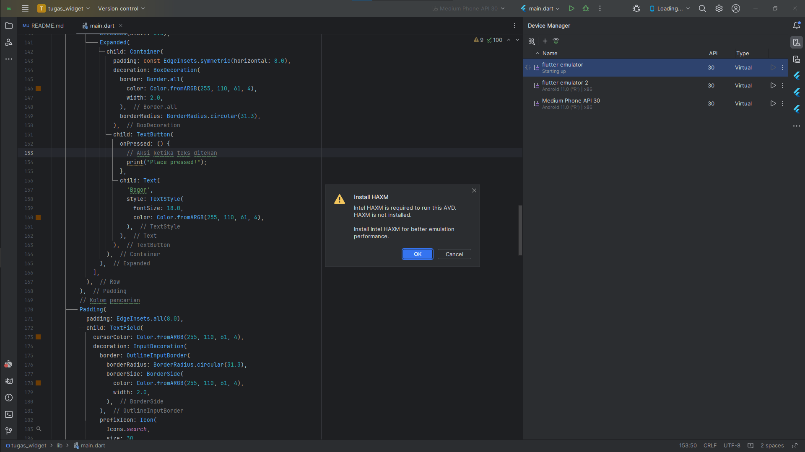

# tugas_widget

A new Flutter project (membuat widget).

Nama : Davina Dwi Angelica
NPM  : 4521210051
Mata Kuliah : PBM
Tugas teori PBM membuat layout.

## Getting Started

This project is a starting point for a Flutter application.

A few resources to get you started if this is your first Flutter project:

- [Lab: Write your first Flutter app](https://docs.flutter.dev/get-started/codelab)
- [Cookbook: Useful Flutter samples](https://docs.flutter.dev/cookbook)

For help getting started with Flutter development, view the
[online documentation](https://docs.flutter.dev/), which offers tutorials,
samples, guidance on mobile development, and a full API reference.

